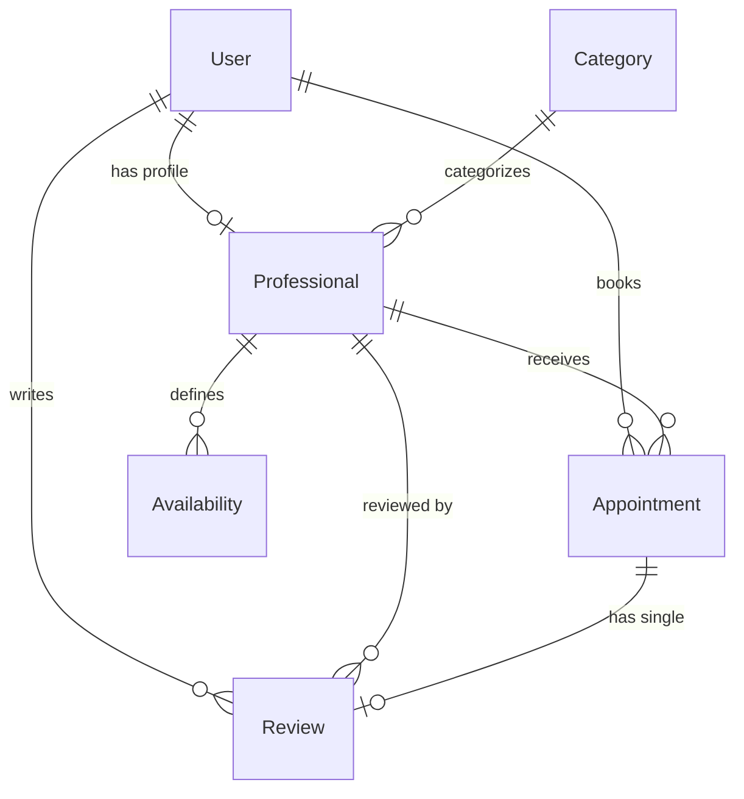
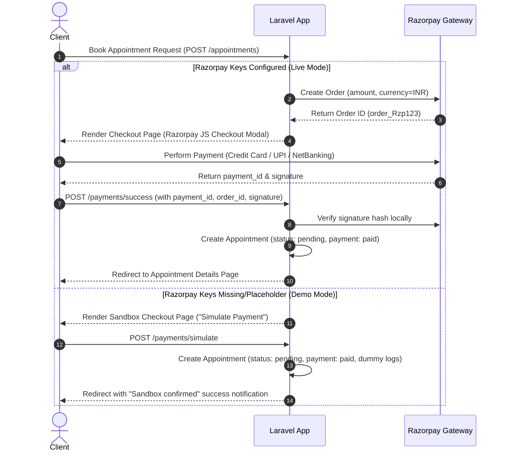

# 🌌 Epoch
**Find the right professional. Pick a real slot. Confirm the appointment.**

Epoch is a high-performance, Laravel-powered appointment booking platform that bridges clients with trusted professionals—including doctors, tutors, consultants, lawyers, therapists, and fitness coaches. Featuring real-time slot generation, interactive scheduling engines, localization, automated mail queues, and Razorpay integration, Epoch provides a complete, modern marketplace experience.

---

<p align="center">
  
  
  
  
  
</p>

---

## 🚀 Core Features

- **🌐 Double-sided Marketplace:** Public category exploration, professional bios, reviews, locations, and search filtering.
- **📅 Dynamic Slot Engine:** Auto-calculates available slots for a chosen date based on weekly operating hours, automatically omitting conflicting pending/confirmed appointments.
- **💳 Multi-Mode Payments:** Integrated Razorpay checkout with secure webhook/signature verification, featuring a local simulation/demo mode for easy testing.
- **✉️ Automated Notifications:** Queued confirmation and cancellation emails sent dynamically to clients and professionals.
- **🗺️ Tri-Role Architecture:** Dedicated workspaces and dashboards tailored for Clients, Professionals, and Administrators.
- **📖 API Surface:** Complete public and Sanctum-secured REST API with pagination, validation, and JSON schemas.
- **💬 Dual-Language Interface:** High-quality translation and local formatting in both **English** and **Hindi**.

---

## 🛠️ Technology Stack

| Component | Technology | Description |
| :--- | :--- | :--- |
| **Backend Framework** | Laravel 12.x | Secure MVC core, Eloquent ORM, queued mailers, Sanctum auth, and routing |
| **Primary Database** | MongoDB | Stored via `mongodb/laravel-mongodb` for scalable JSON-first records |
| **Frontend UI** | Blade + Alpine.js | Reactive, lightweight client-side state without heavy SPA builds |
| **Styling Engine** | Tailwind CSS 3.x | Modern utility classes and fluid responsive layouts |
| **Asset Bundling** | Vite | Ultra-fast asset builds and Hot Module Replacement (HMR) |
| **Payment Gateway** | Razorpay SDK | Secure online checkouts, order tokens, and signature checks |
| **Task Queue** | Laravel Queue | Background mail sending and system cleaning tasks |

---

## ⚙️ Quick Start Installation

Follow these steps to deploy a local instance of the platform:

### 1. Prerequisites
- **PHP 8.2+** (with JSON, MongoDB drivers installed)
- **Composer**
- **Node.js** & **npm**
- **MongoDB** running locally on port `27017`

### 2. Install Dependencies & Build Assets
```bash
# Clone the repository and install packages
composer install
npm install

# Build the frontend bundle
npm run build
```

### 3. Environment & Database Setup
Copy the environment template and generate the application key:
```bash
cp .env.example .env
php artisan key:generate
```

Ensure your `.env` database configuration targets your MongoDB server:
```ini
DB_CONNECTION=mongodb
DB_HOST=127.0.0.1
DB_PORT=27017
DB_DATABASE=epoch
```

Run database migrations and seed the platform with sample categories, professionals, users, and reviews:
```bash
php artisan migrate --seed
```

> [!NOTE]
> The seeders automatically create a superuser admin account:
> - **Email:** `admin@epoch.com`
> - **Password:** `password`

### 4. Running the Project Locally
Run the development environment (starts the Laravel local server, Vite compiler, queue runner, and logs stream concurrently):
```bash
composer run dev
```
Open **`http://localhost:8000`** in your browser.

---

## 📊 Database Schema

Epoch operates on a flexible, JSON-friendly MongoDB model structure. The schema includes the following primary collections:



### 1. `users`
Stores user profile information, auth credentials, and platform roles.
- `id` (ObjectId) — Primary Key
- `name` (String) — User's display name
- `email` (String) — Unique email address
- `password` (String) — Hashed password
- `role` (Enum: `user`, `professional`, `admin`) — System access level
- `phone` (String, nullable) — Contact number
- `avatar` (String, nullable) — File path to profile picture
- `timezone` (String) — Preferred timezone (defaults to `Asia/Kolkata`)

### 2. `professionals`
Detailed marketplace profiles of registered service providers.
- `id` (ObjectId) — Primary Key
- `user_id` (ObjectId) — References `users.id`
- `category_id` (ObjectId) — References `categories.id`
- `bio` (String) — Long professional summary
- `experience_years` (Integer) — Total years of industry experience
- `location` (String) — Working location/city
- `photo` (String, nullable) — Image path/fallback URL
- `consultation_fee` (Decimal) — Charging fee per session
- `session_duration` (Integer) — Meeting length (15, 30, 45, or 60 minutes)
- `is_active` (Boolean) — Verified / active state on marketplace (toggleable by admin)
- `rating` (Decimal) — Computed average user rating (0.00 to 5.00)
- `total_reviews` (Integer) — Sum of completed reviews
- `specializations` (Array) — List of tags (e.g., `["Anxiety", "CBT"]`)

### 3. `availabilities`
Weekly operational times defined by professionals.
- `id` (ObjectId) — Primary Key
- `professional_id` (ObjectId) — References `professionals.id`
- `day_of_week` (Integer) — `0` (Sunday) to `6` (Saturday)
- `start_time` (Time) — e.g. `09:00:00`
- `end_time` (Time) — e.g. `17:00:00`
- `is_active` (Boolean) — Availability status

### 4. `appointments`
Transactions and status of client-professional interactions.
- `id` (ObjectId) — Primary Key
- `user_id` (ObjectId) — Client ID (references `users.id`)
- `professional_id` (ObjectId) — Provider ID (references `professionals.id`)
- `appointment_date` (Date) — Scheduled date
- `time_slot` (String) — Time window (e.g. `09:00-09:30`)
- `status` (Enum: `pending`, `confirmed`, `cancelled`, `completed`)
- `notes` (String, nullable) — Special requests or details
- `meeting_link` (String, nullable) — Virtual room URL (Google Meet / Zoom link)
- `fee` (Decimal) — Recorded fee paid at booking time
- `confirmed_at` (Timestamp, nullable) — Confirmed time
- `cancelled_at` (Timestamp, nullable) — Cancellation time
- `cancellation_reason` (String, nullable) — Stated reason for cancellation
- `razorpay_order_id` (String, nullable) — Razorpay order reference
- `razorpay_payment_id` (String, nullable) — Razorpay transaction ID
- `razorpay_signature` (String, nullable) — Secure hash from payment response
- `payment_status` (Enum: `pending`, `paid`, `failed`, `refunded`)

### 5. `categories`
Marketplace sectors for services.
- `id` (ObjectId) — Primary Key
- `name` (String) — Display title (e.g. `Therapists`)
- `slug` (String) — URL-friendly string (e.g. `therapists`)
- `description` (String, nullable) — Subtitle description
- `icon` (String) — Lucide icon name string (default `briefcase`)
- `color` (String) — Aesthetic border/accent color (default `#6366f1`)

---

## 🌐 Web Interface Endpoints

Epoch contains a complete Laravel Blade-rendered dashboard flow.

### 👥 Public Routes
| Method | Path | Controller Action | Description |
| :--- | :--- | :--- | :--- |
| **GET** | `/` | `HomeController@index` | Marketplace homepage (statistics & featured professionals) |
| **GET** | `/professionals` | `ProfessionalController@index` | Provider directory with search, category, location, and sorting filters |
| **GET** | `/professionals/{id}` | `ProfessionalController@show` | Detail page showing bio, reviews, and interactive time slot picker |
| **GET** | `/locale/{locale}` | *(Closure)* | Switch locale toggler (`en` / `hi`) |
| **GET** | `/contact` | `HomeController@contact` | View contact form |
| **POST**| `/contact` | `HomeController@submitContact` | Submit contact form, storing message in database |
| **POST**| `/contact-send` | `ContactController@send` | Direct contact form submission mailing |

### 🔑 Authentication Routes
| Method | Path | Controller Action | Description |
| :--- | :--- | :--- | :--- |
| **GET** | `/login` | `AuthController@showLogin` | Show Login UI |
| **POST**| `/login` | `AuthController@login` | Validate user credentials and create session |
| **GET** | `/register` | `AuthController@showRegister` | Show registration form (Client vs Professional option) |
| **POST**| `/register` | `AuthController@register` | Create account and log the user in |
| **POST**| `/logout` | `AuthController@logout` | Invalidate session and clear tokens |

### 🧑 Client Workspace (Authenticated)
| Method | Path | Controller Action | Description |
| :--- | :--- | :--- | :--- |
| **GET** | `/dashboard` | `UserDashboardController@index` | Client overview (upcoming appointments, past history, quick stats) |
| **GET** | `/appointments` | `AppointmentController@index` | Paginated index of personal bookings |
| **GET** | `/appointments/create` | `AppointmentController@create` | Render checkout/confirm booking page for a chosen slot |
| **POST**| `/appointments` | `AppointmentController@store` | Stores appointment in DB (usually triggered via checkout) |
| **GET** | `/appointments/{id}` | `AppointmentController@show` | Detail view of a booking (includes payment status and meeting link) |
| **PATCH**| `/appointments/{id}/cancel` | `AppointmentController@cancel` | Allows client to cancel upcoming appointments (if in future) |
| **DELETE**| `/appointments/{id}` | `AppointmentController@destroy` | Delete appointment (soft delete/destroy action) |

### 💼 Professional Workspace (Authenticated + Professional Role)
| Method | Path | Controller Action | Description |
| :--- | :--- | :--- | :--- |
| **GET** | `/professional/dashboard` | `ProfessionalDashboardController@index` | Professional control panel (pending reviews, scheduling calendar, revenue stats) |
| **PATCH**| `/professional/appointments/{id}/confirm` | `ProfessionalDashboardController@confirm` | Confirm a booking and queue client notification email |
| **PATCH**| `/professional/appointments/{id}/reject` | `ProfessionalDashboardController@reject` | Decline booking with optional reason and notify client |
| **PATCH**| `/professional/appointments/{id}/complete` | `ProfessionalDashboardController@complete` | Mark completed slot (moves appointment status to `completed`) |
| **GET** | `/professional/profile/create` | `ProfessionalController@create` | Onboarding profile registration form |
| **POST**| `/professional/profile` | `ProfessionalController@store` | Save initial professional bio, photo, and fee data |
| **GET** | `/professional/profile/{id}/edit` | `ProfessionalController@edit` | Edit bio, fees, locations, and specializations |
| **PUT** | `/professional/profile/{id}` | `ProfessionalController@update` | Commit profile changes |
| **POST**| `/professional/availability` | `ProfessionalDashboardController@updateAvailability` | Set daily operating time slots |

### 🛡️ Admin Panel (Authenticated + Admin Role)
| Method | Path | Controller Action | Description |
| :--- | :--- | :--- | :--- |
| **GET** | `/admin/dashboard` | `AdminController@dashboard` | Platform metrics (total revenue, active user counts, recent events) |
| **GET** | `/admin/users` | `AdminController@users` | Search and filter registered accounts |
| **DELETE**| `/admin/users/{user}` | `AdminController@destroyUser` | Permanently remove user and cascade delete related data |
| **GET** | `/admin/professionals` | `AdminController@professionals` | View and edit provider status list |
| **PATCH**| `/admin/professionals/{id}/toggle` | `AdminController@toggleProfessional` | Toggle professional active state (suspend/verify) |
| **GET** | `/admin/categories` | `AdminController@categories` | View categories and their professional counts |
| **POST**| `/admin/categories` | `AdminController@storeCategory` | Insert new service category into database |
| **GET** | `/admin/appointments` | `AdminController@appointments` | Master control list of all bookings in the system |

---

## 🔌 RESTful API Reference

The Epoch API provides high-quality programmatic endpoints for profile discovery and appointment orchestration.

### Authorization
Authenticated endpoints require a Bearer token generated through Laravel Sanctum:
```http
Authorization: Bearer <your-sanctum-token>
Accept: application/json
Content-Type: application/json
```

---

### 🌐 Public Endpoints

#### 1. API Status check
- **Endpoint:** `GET /api/ping`
- **Auth:** `None`
- **Response:**
  ```json
  {
    "status": "ok",
    "service": "Epoch API",
    "version": "1.0"
  }
  ```

#### 2. Get Professional Listing
- **Endpoint:** `GET /api/professionals`
- **Auth:** `None`
- **Query Parameters:**
  | Parameter | Type | Required | Description |
  | :--- | :--- | :--- | :--- |
  | `category` | String | No | Filter by category slug (e.g. `therapists`) |
  | `search` | String | No | Search professionals by name |
  | `page` | Integer | No | Page number for pagination (returns 15 per page) |

- **Success Response (200 OK):**
  <details>
  <summary><b>View Response Body</b></summary>

  ```json
  {
    "status": "success",
    "data": {
      "current_page": 1,
      "data": [
        {
          "id": 1,
          "user_id": 2,
          "category_id": 1,
          "bio": "Specialized in cognitive behavioral therapy with over 8 years of clinical experience.",
          "experience_years": 8,
          "location": "Mumbai, India",
          "photo": "professionals/doctor1.jpg",
          "consultation_fee": "1200.00",
          "session_duration": 45,
          "is_active": true,
          "rating": "4.85",
          "total_reviews": 12,
          "specializations": ["CBT", "Anxiety", "Stress Management"],
          "created_at": "2026-05-15T04:25:20.000000Z",
          "updated_at": "2026-05-25T16:04:20.000000Z",
          "user": {
            "id": 2,
            "name": "Dr. Aarav Sharma"
          },
          "category": {
            "id": 1,
            "name": "Therapists",
            "slug": "therapists"
          }
        }
      ],
      "first_page_url": "http://localhost/api/professionals?page=1",
      "from": 1,
      "last_page": 1,
      "last_page_url": "http://localhost/api/professionals?page=1",
      "next_page_url": null,
      "path": "http://localhost/api/professionals",
      "per_page": 15,
      "prev_page_url": null,
      "to": 1,
      "total": 1
    }
  }
  ```
  </details>

#### 3. Get Professional Details
- **Endpoint:** `GET /api/professionals/{id}`
- **Auth:** `None`
- **Route Parameters:**
  | Parameter | Type | Required | Description |
  | :--- | :--- | :--- | :--- |
  | `id` | Integer | Yes | The database ID of the professional |

- **Success Response (200 OK):**
  <details>
  <summary><b>View Response Body</b></summary>

  ```json
  {
    "status": "success",
    "data": {
      "id": 1,
      "user_id": 2,
      "category_id": 1,
      "bio": "Specialized in cognitive behavioral therapy with over 8 years of clinical experience.",
      "experience_years": 8,
      "location": "Mumbai, India",
      "photo": "professionals/doctor1.jpg",
      "consultation_fee": "1200.00",
      "session_duration": 45,
      "is_active": true,
      "rating": "4.85",
      "total_reviews": 12,
      "specializations": ["CBT", "Anxiety"],
      "user": {
        "id": 2,
        "name": "Dr. Aarav Sharma",
        "email": "aarav@epoch.com"
      },
      "category": {
        "id": 1,
        "name": "Therapists",
        "slug": "therapists",
        "description": "Professional counseling and psychiatric consultation",
        "icon": "brain",
        "color": "#6366f1"
      },
      "availabilities": [
        {
          "id": 1,
          "professional_id": 1,
          "day_of_week": 1,
          "start_time": "09:00:00",
          "end_time": "17:00:00",
          "is_active": true
        }
      ],
      "reviews": [
        {
          "id": 5,
          "user_id": 3,
          "professional_id": 1,
          "appointment_id": 2,
          "rating": 5,
          "comment": "Incredible listener. Highly recommended!",
          "user": {
            "id": 3,
            "name": "Jane Doe"
          }
        }
      ]
    },
    "slots": {
      "2026-05-27": [
        "09:00-09:45",
        "09:45-10:30",
        "11:15-12:00"
      ],
      "2026-05-28": [
        "10:30-11:15",
        "14:00-14:45"
      ]
    }
  }
  ```
  </details>

- **Error Response (404 Not Found):**
  ```json
  {
    "message": "The professional you requested does not exist."
  }
  ```

---

### 🔒 Authenticated Endpoints (Bearer Token Required)

#### 4. Get Authenticated User Details
- **Endpoint:** `GET /api/user`
- **Auth:** `Bearer Token`
- **Response (200 OK):**
  ```json
  {
    "id": 3,
    "name": "Jane Doe",
    "email": "jane@example.com",
    "role": "user",
    "phone": "+919876543210",
    "avatar": "avatars/jane.png",
    "timezone": "Asia/Kolkata",
    "created_at": "2026-05-15T04:25:20.000000Z",
    "updated_at": "2026-05-25T16:04:20.000000Z",
    "avatar_url": "http://localhost/storage/avatars/jane.png"
  }
  ```

#### 5. List Authenticated Client's Appointments
- **Endpoint:** `GET /api/appointments`
- **Auth:** `Bearer Token`
- **Success Response (200 OK):**
  <details>
  <summary><b>View Response Body</b></summary>

  ```json
  {
    "status": "success",
    "data": {
      "current_page": 1,
      "data": [
        {
          "id": 10,
          "user_id": 3,
          "professional_id": 1,
          "appointment_date": "2026-05-27",
          "time_slot": "09:00-09:45",
          "status": "confirmed",
          "notes": "Follow-up session.",
          "meeting_link": "https://meet.google.com/abc-defg-hij",
          "fee": "1200.00",
          "confirmed_at": "2026-05-25T17:00:00.000000Z",
          "cancelled_at": null,
          "cancellation_reason": null,
          "razorpay_order_id": "order_Rzp123abc",
          "razorpay_payment_id": "pay_Rzp987xyz",
          "payment_status": "paid",
          "created_at": "2026-05-25T16:50:00.000000Z",
          "updated_at": "2026-05-25T17:00:00.000000Z",
          "user": {
            "id": 3,
            "name": "Jane Doe",
            "email": "jane@example.com"
          },
          "professional": {
            "id": 1,
            "user": {
              "id": 2,
              "name": "Dr. Aarav Sharma"
            }
          }
        }
      ],
      "first_page_url": "http://localhost/api/appointments?page=1",
      "from": 1,
      "last_page": 1,
      "last_page_url": "http://localhost/api/appointments?page=1",
      "next_page_url": null,
      "path": "http://localhost/api/appointments",
      "per_page": 15,
      "prev_page_url": null,
      "to": 1,
      "total": 1
    }
  }
  ```
  </details>

#### 6. Book New Appointment
- **Endpoint:** `POST /api/appointments`
- **Auth:** `Bearer Token`
- **Request Body Parameters:**
  | Field | Type | Required | Description |
  | :--- | :--- | :--- | :--- |
  | `professional_id` | Integer | Yes | ID of the professional |
  | `appointment_date` | Date (YYYY-MM-DD) | Yes | Must be a future date (greater than today) |
  | `time_slot` | String | Yes | e.g. `09:00-09:45`. Must be currently free for the provider |
  | `notes` | String | No | Brief explanation or notes (max 500 characters) |

- **Success Response (201 Created):**
  <details>
  <summary><b>View Response Body</b></summary>

  ```json
  {
    "status": "success",
    "message": "Appointment booked successfully.",
    "data": {
      "id": 11,
      "user_id": 3,
      "professional_id": 1,
      "appointment_date": "2026-05-28",
      "time_slot": "10:30-11:15",
      "notes": "Discussing anxiety treatment plans.",
      "fee": "1200.00",
      "status": "pending",
      "payment_status": "pending",
      "created_at": "2026-05-25T22:47:00.000000Z",
      "updated_at": "2026-05-25T22:47:00.000000Z",
      "professional": {
        "id": 1,
        "user": {
          "id": 2,
          "name": "Dr. Aarav Sharma"
        }
      }
    }
  }
  ```
  </details>

- **Error Response (422 Unprocessable Content - Validation Failure):**
  ```json
  {
    "message": "The selected time slot is already booked. Please choose another slot.",
    "errors": {
      "time_slot": [
        "This time slot is already booked. Please choose another slot."
      ],
      "appointment_date": [
        "The appointment date must be a future date."
      ]
    }
  }
  ```

#### 7. View Specific Appointment Details
- **Endpoint:** `GET /api/appointments/{id}`
- **Auth:** `Bearer Token`
- **Route Parameters:**
  | Parameter | Type | Required | Description |
  | :--- | :--- | :--- | :--- |
  | `id` | Integer | Yes | The database ID of the appointment |

- **Authorization Rules:** Accessible only by the Client who booked it, the Professional assigned to it, or an Admin.

- **Success Response (200 OK):**
  ```json
  {
    "status": "success",
    "data": {
      "id": 10,
      "user_id": 3,
      "professional_id": 1,
      "appointment_date": "2026-05-27",
      "time_slot": "09:00-09:45",
      "status": "confirmed",
      ...
    }
  }
  ```

- **Error Response (403 Forbidden - Accessing other's appointment):**
  ```json
  {
    "status": "error",
    "message": "Unauthorized"
  }
  ```

#### 8. Update Appointment Status (By Professional)
- **Endpoint:** `PUT/PATCH /api/appointments/{id}`
- **Auth:** `Bearer Token`
- **Route Parameters:**
  | Parameter | Type | Required | Description |
  | :--- | :--- | :--- | :--- |
  | `id` | Integer | Yes | The database ID of the appointment |

- **Authorization Rules:** Accessible only by the Professional assigned to this appointment.
- **Request Body Parameters:**
  | Field | Type | Required | Description |
  | :--- | :--- | :--- | :--- |
  | `status` | String | Yes | Must be one of: `confirmed`, `cancelled`, `completed` |
  | `reason` | String | No | Cancellation or update reason (max 255 characters) |

- **Success Response (200 OK):**
  ```json
  {
    "status": "success",
    "message": "Appointment updated.",
    "data": {
      "id": 10,
      "status": "confirmed",
      "confirmed_at": "2026-05-25T22:50:00.000000Z",
      ...
    }
  }
  ```

#### 9. Cancel Appointment (By Client or Admin)
- **Endpoint:** `DELETE /api/appointments/{id}`
- **Auth:** `Bearer Token`
- **Route Parameters:**
  | Parameter | Type | Required | Description |
  | :--- | :--- | :--- | :--- |
  | `id` | Integer | Yes | The database ID of the appointment |

- **Authorization Rules:** Accessible only by the Client who booked it, or an Admin.
- **Business Logic:** The appointment status must be `pending` or `confirmed` and scheduled in the future (`appointment_date->isFuture()`). Completed or past appointments cannot be cancelled.

- **Success Response (200 OK):**
  ```json
  {
    "status": "success",
    "message": "Appointment cancelled."
  }
  ```

- **Error Response (422 Unprocessable Content - Already Passed/Completed):**
  ```json
  {
    "status": "error",
    "message": "Appointment cannot be cancelled."
  }
  ```

---

## 💳 Payment Workflows & Lifecycle

Epoch supports dual payment pathways based on environment configuration:



### Razorpay Configuration Settings
To shift from sandbox simulation into live Razorpay checkouts, specify valid keys in your `.env` file:
```ini
RAZORPAY_KEY_ID=rzp_live_xxxxxxxxxxxxx
RAZORPAY_KEY_SECRET=yyyyyyyyyyyyyyyyyyyyyyyy
```
When keys are missing or contain `rzp_test_YourKeyIdHere`, the application automatically redirects users into **Demo Payment Simulation** mode.

---

## 🛠️ Developer Utility Commands

Use these Artisan and npm shortcuts to manage your development loop:

```bash
# Clean database, run migrations, and reseed with mock marketplace items
php artisan migrate:fresh --seed

# Spin up server, queue runner, hot assets reloader, and log streaming concurrently
composer run dev

# Run full PHPUnit feature and integration test suites
php artisan test

# Build production compiled frontend CSS and JS assets
npm run build
```

> [!TIP]
> On Windows PowerShell, if native `npm` binary resolution triggers execution blocking, run commands explicitly using the `.cmd` wrapper:
> ```powershell
> npm.cmd install
> npm.cmd run build
> ```

---

## 📄 License
This platform is open-source software licensed under the [MIT License](LICENSE).
